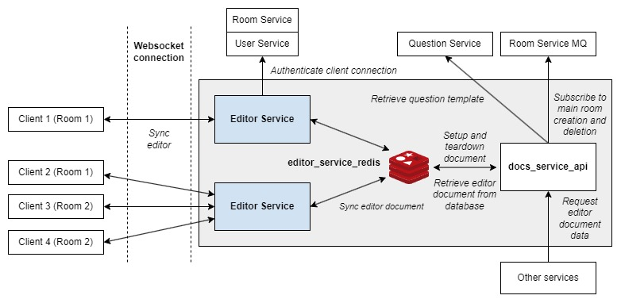

# PeerPrep Docs Service

> Manages editor documents

While [Editor Service](https://github.com/CS3219-AY2324S1-G04/peerprep_editor_service) communicates directly with clients to facilitate the synchronization of editor documents for real-time collaboration, Docs Service performs several key functions to support Editor Service.

- **Document Setup**: Insertion of question code template on room creation.
- **Document Teardown**: Propagates the room deletion event to Editor Service instances through Redis and clears the document data from Redis.
- **Document Retrieval**: Provides a REST API endpoint for other PeerPrep services to retrieve document data.

## Table of Contents

- [PeerPrep Docs Service](#peerprep-docs-service)
  - [Table of Contents](#table-of-contents)
  - [Requirements](#requirements)
  - [Quick Start](#quick-start)
  - [Build Script](#build-script)
  - [Environment Variables](#environment-variables)
  - [Overview](#overview)
    - [Editor Service](#editor-service)
    - [editor\_service\_redis](#editor_service_redis)
    - [docs\_service\_api](#docs_service_api)
  - [Docker Images](#docker-images)
    - [API](#api)
  - [Deployment](#deployment)
    - [Kubernetes Deployment](#kubernetes-deployment)
    - [Docker Compose Deployment](#docker-compose-deployment)
  - [REST API](#rest-api)
    - [Retrieve editor document text](#retrieve-editor-document-text)

## Requirements

Docs Service requires the following services to operate correctly.

- [Room Service](https://github.com/CS3219-AY2324S1-G04/peerprep_room_service) - Provides room creation and deletion events.
- [Editor Service](https://github.com/CS3219-AY2324S1-G04/peerprep_editor_service) - (Required for Docker Compose deployment) Provides the Redis database.

## Quick Start

1. Clone this repository.
2. Configure the `.env` file (Refer to [Environment Variables](#environment-variables))
3. Install the necessary dependencies `npm install`
4. Run the [build script](#build-script).
5. Run the docker container. `docker compose up -d`

## Build Script

`build_images.sh` is a build script for building the Docker images and optionally pushing them to the container registry. To get more information about the script, run:

`./build_images.sh -h`

## Environment Variables

| Variable Name | Default Value | Description |
| ------------- | ------------- | ----------- |
| DOCS_SERVICE_PORT | 9007 | The port the server listens on for REST API. |
| DOCS_SERVICE_ROUTE | '/docs-service' | Endpoint for receiving messages. |
| REDIS_HOST | 'editor_service_redis' | Host for the redis database |
| REDIS_PORT | 6379 | Port for the redis database |
| REDIS_USERNAME | 'default' | Username for redis database authentication |
| REDIS_PASSWORD | 'password' | Password for redis database authentication |
| REDIS_DB | 0 | Database index used for redis database |
| MQ_USER | 'user' | Username for Room Service MQ |
| MQ_PASSWORD | 'P@ssword123' | Password for Room Service MQ |
| MQ_HOST | 'localhost' | Host for Room Service MQ |
| MQ_PORT | 5672 | Port for Room Service MQ |
| MQ_EXCHANGE_NAME | 'room-events' | Exchange name for Room Service MQ |
| MQ_QUEUE_NAME | 'docs-service-room-event-queue' | Queue name for Room Service MQ |

## Overview



The above architectural diagram describes the main interactions between the clients, multiple instances of Editor Service, Docs Service and Redis.

### Editor Service

- Editor Service instance that establishes and authenticates WebSocket connections with clients.
- Synchronizes changes to editor documents between clients.
  - A single document can be shared by multiple clients.
- Supports horizontal scaling using Kubernetes deployment.
- For more information, refer to [Editor Service](https://github.com/CS3219-AY2324S1-G04/peerprep_editor_service).

### editor_service_redis

- Redis database that serves as a message broker between Editor Service instances, propagating changes between editor documents.
- Supports horizontal scaling using Redis Cluster.

### docs_service_api

- A Docs Service instance that provides document setup and teardown based on room creation and deletion events from the Room Service MQ.
- **Setup**: Insertion of question code template.
- **Teardown**: Publishes room deletion message to Editor Service instances through Redis and clears the document data from Redis.
- **Document Retrieval**: Provides a REST API endpoint for other services to retrieve document data.
- Supports horizontal scaling using Kubernetes deployment.

## Docker Images

### API

**Name**: ghcr.io/cs3219-ay2324s1-g04/peerprep_docs_service_api

**Description**: Runs the Docs Service container.

## Deployment

### Kubernetes Deployment

This is the main deployment method for production.

**Note:**

- The database is hosted externally, not within the Kubernetes cluster.

**Prerequisite**

- Docker images must be pushed to the container registry and made public.
  - To push to the container registry (assuming one has the necessary permissions), run: `./build_images.sh -p`
  - To make the images public, change the visibility of the image on [GitHub](https://github.com/orgs/CS3219-AY2324S1-G04/packages).
- Kubernetes cluster must be setup as specified in the [main repository](https://github.com/CS3219-AY2324S1/ay2324s1-course-assessment-g04#deployment).

**Steps:**

1. Ensure the "peerprep" namespace has been created: `kubectl create namespace peerprep`
2. Navigate to the "kubernetes" directory: `cd kubernetes`
3. Deploy the Kubernetes objects: `./deploy.sh`
    - To delete the Kubernetes objects, run: `./delete.sh`

### Docker Compose Deployment

This is intended for development use only. It is meant to make developing other services easier.

**Note:**

- No horizontal auto scaling is provided.
- The database is created by Docker compose and data is not backed up.

## REST API

### Retrieve editor document text

> [GET] `/docs-service/docs/:roomId`

Retrieve the editor document text corresponding to a specified room.

This is only intended to be used by other services.

**Path Parameters**

- `room-id` - Room ID of the room that owns the editor document.

**Response**

- `200` - Success. Document text data is stored in the response body.
  - Example response body:
    ```json
    {
      "doc": "lorem ipsum",
    }
    ```
- `400` - Error caused by invalid request.
- `404` - The requested editor document does not exist.
- `500` - Unexpected error occurred on the server.
